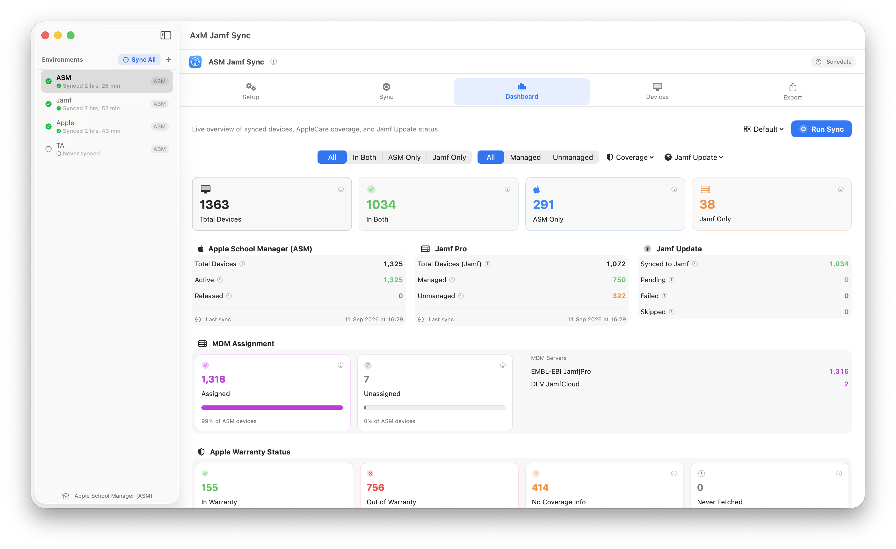
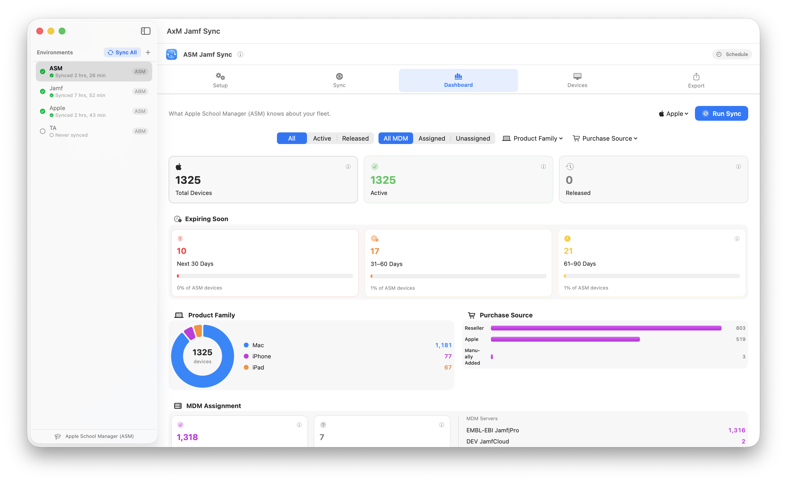
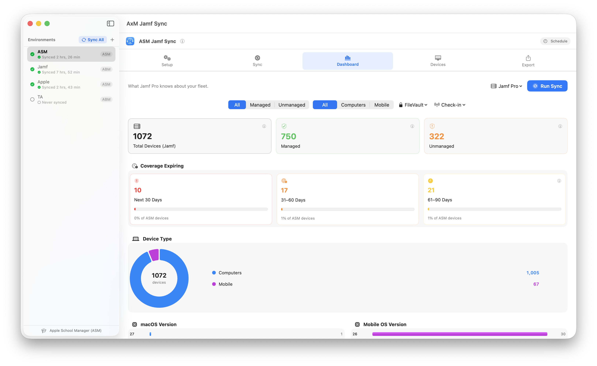
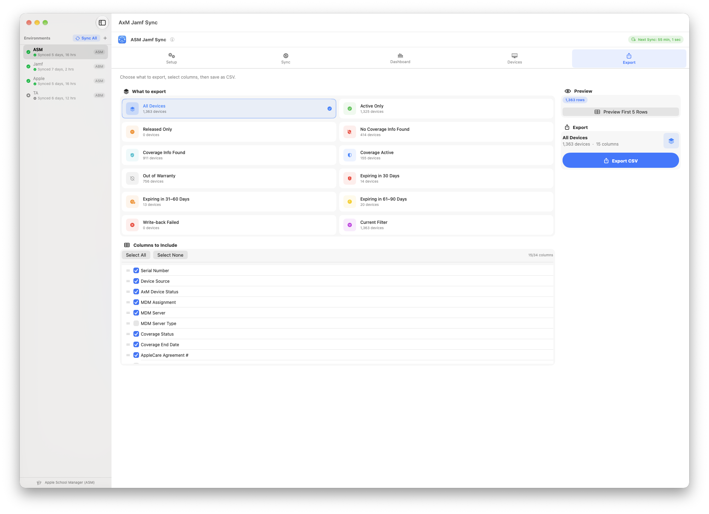

<div align="center">


# AxM Jamf Sync

<p align="center">
  <a href="#what-it-does">What it does</a> •
  <a href="#requirements">Requirements</a> •
  <a href="#installation">Installation</a> •
  <a href="#quick-start">Quick Start</a> •
  <a href="#tabs-overview">Tabs Overview</a> •
  <a href="https://github.com/karthikeyan-mac/AxMJamfSync/wiki">Wiki</a> •
  <a href="#license">License</a>
</p>

**Sync AppleCare warranty coverage from Apple Business Manager (ABM) or Apple School Manager (ASM) into Jamf Pro — across multiple environments, in four steps, on one Mac.**

[](https://www.apple.com/macos/)
[](https://swift.org/)
[](https://developer.apple.com/xcode/swiftui/)
[](LICENSE)
[](https://developer.apple.com/support/code-signing/)
[](https://developer.apple.com/documentation/security/notarizing_macos_software_before_distribution)

</div>

---

## What it does

AxM Jamf Sync runs a four-step pipeline on demand:

| Step | What happens |
|------|-------------|
| **1 — AxM Devices** | Downloads every device record from your ABM or ASM organisation |
| **2 — Jamf Inventory** | Downloads computers and mobile devices from Jamf Pro |
| **3 — AppleCare Coverage** | Fetches warranty and AppleCare status from Apple's coverage API |
| **4 — Jamf Update** | Writes warranty date, AppleCare agreement number, vendor, PO number, and PO date back to each matching Jamf record |

The result: every device record in Jamf Pro shows accurate, up-to-date warranty and purchasing information pulled straight from Apple — no spreadsheets, no manual entry.

---

## What's new in v2.4 — Dashboard Focus Modes & Reliability

v2.4 splits the Dashboard into focused views, closes several data-integrity gaps found during a deep architecture review, and polishes Setup, Sync, Devices, Export, and the environment sidebar.

**Dashboard focus modes**
- The Dashboard is now three views instead of one: **Default** (today's mixed ABM/ASM + Jamf reconciliation), **Apple** (everything scoped to your ABM/ASM-sourced fields), and **Jamf Pro** (everything scoped to Jamf-sourced fields) — pick a focus from the menu next to Run Sync
- Each focus mode has its own facet filter bar (source, coverage, managed status, device type, FileVault, check-in freshness, product family, purchase source, and more) — filtering the Dashboard never touches the Devices tab's own filters
- Every number on every card is tappable — it drills straight into the Devices tab pre-filtered to exactly what was counted, with any active facet carried along
- New chart types: donut charts (product family, device type, FileVault), horizontal bar charts (purchase source, OS version), and a year-over-year trend chart (devices added to org) — all Swift Charts, animated, light/dark aware

**Security & data integrity**
- **Cached tokens are now scoped to a SHA-256 identity** (origin + client ID) — one environment can no longer load another's cached Apple or Jamf token, and a stale token can't survive a host or client-ID change within an environment
- **Jamf write-back now re-validates the serial→device mapping** whenever the Jamf URL or client ID changes — previously a changed Jamf connection could silently PATCH warranty data onto the wrong physical machine using a stale cached mapping
- **Sync runs report one of four honest outcomes** — Success, Partial, Failed, or Cancelled — instead of always looking like success even when part of a run failed
- **Environment deletion now quiesces before it deletes** — any in-flight sync is stopped and Core Data is cleanly detached before files are removed, closing a race that could corrupt a store mid-delete
- **AxM device fetch commits each batch to disk before advancing its resume checkpoint**, so an interrupted large fetch can never silently skip a page of devices on resume
- **v1→v2 migration verifies the copied credentials and device count before deleting the originals** — a failed migration now leaves your original data completely untouched and retries next launch

**Setup, Sync, Devices, Export, Sidebar**
- Setup: credentials save automatically as you type — no more "Save to Keychain" checkbox — with a status line showing when each set was saved and last verified, and a masked Key ID next to your loaded private key
- Sync: a redone Last Run Summary (Apple devices, Jamf devices, coverage checked, Jamf updated, Jamf failed, duration — each with a Mac/Mobile split), a resizable log pane that only auto-scrolls while you're already at the bottom (with a Jump to Latest button when you've scrolled up), a log Clear button, and a Warn+ log filter
- Devices: search now also matches username, Jamf ID, AppleCare agreement number, MDM server, order number, and model identifier; select multiple devices at once to copy their serials or export just that selection; every device offers Copy Serial / Copy Jamf ID / **Open in Jamf Pro** from a right-click or the detail panel
- Export: four new presets (Expiring in 30/31–60/61–90 Days, Write-back Failed), drag-to-reorder columns whose order and selection now actually persist across launches (previously silently didn't save at all), a **Show in Finder** button after export, and filenames that include the environment name
- Sidebar: environment rows are now natively keyboard-navigable, show sync recency instead of a redundant scope label, and support inline rename (double-click the name, or press Return) — the delete icon only appears on hover
- New **Help → Export Diagnostics…** — bundles app/environment metadata, a per-environment settings summary (never credentials or server hosts), and every log file into a zip, for sharing when troubleshooting

### Upgrade Notes
No migration required. Existing credentials, cache, and preferences carry over unchanged.

---

## What's new in v2.3 — Scheduling

v2.3 adds **automatic scheduling** — sync every environment on a recurring cadence without opening the app.

- **Friendly schedule builder** — pick "Repeat Every: Minute(s) / Hour(s) / Day(s) / Week(s) / Month(s)" and fill in the values that unit needs; no cron syntax required
- **Advanced (Raw Cron Expression)** — a collapsible field for hand-written 5-field cron, for anyone who wants it
- **Launch at Login** — optionally reopen AxM Jamf Sync automatically so scheduled syncs keep running unattended
- **Menu bar icon** — always available, with Sync All Now, next/last sync times, and quick access to Settings
- **Show in Dock** toggle — run as a normal Dock app or menu-bar-only, independent of the menu bar icon
- Scheduled runs go through the same serial sync queue as **Sync All** — one environment at a time, never in parallel
- **Notifications** for schedule start and completion, alongside the existing per-environment sync notifications
- A live **Next Sync** badge in the header bar doubles as a shortcut into Settings

---

## What's new in v2.2 — Sync Queue

v2.2 introduces a **serial sync queue** so multiple environments sync unattended without risk of parallel Apple API calls.

- **Sync All** button in the sidebar — select environments, add them to the queue, walk away
- **Run Sync** on any environment enqueues rather than triggering immediately — waits its turn if another sync is running
- **In Queue** state shown on the button while waiting
- **Stop & Save** and **Cancel All** controls in the queue progress banner, both with confirmation dialogs
- Browse Dashboard, Devices, and Export freely on any environment while the queue runs on another

---

## What's new in v2.1 — MDM Server Visibility

v2.1 surfaces MDM server assignment throughout the app — device list badges, filter dropdown, detail panel, dashboard card, CSV export, and sync log. Devices in AxM but not enrolled in any MDM server are marked **Unassigned**.

---

## What's new in v2.0 — Multi-Environment

v2.0 introduces **Environments** — fully isolated configurations for MSPs or admins who manage multiple Apple/Jamf tenants.

Each environment has its own:
- ABM or ASM credentials (Keychain-isolated per environment)
- Jamf Pro credentials and server URL
- Device cache (separate SQLite database)
- Sync preferences and timestamps
- Log file

Switch environments instantly from the sidebar. Existing v1 data migrates automatically into a "Default" environment on first launch — no cache wipe required.

---

## Screenshots









---

## Requirements

- **macOS 14.0 (Sonoma)** or later
- **Apple Business Manager** or **Apple School Manager** with API access
- **Jamf Pro** (cloud or on-prem) with an OAuth API client
- An Apple API private key (`.pem` file) from ABM/ASM

---

## Disclaimer

This app was developed with the help of AI agents. Please test thoroughly before using in production. Submit bugs and feature requests in the **Issues** section.

---

## Installation

### Option A — Download release (recommended)

1. Download `AxMJamfSync.dmg` from the [Releases](../../releases) page
2. Open the DMG and drag **AxM Jamf Sync** to Applications
3. Launch — it is signed and notarized, Gatekeeper opens it without warnings

### Option B — Build from source

```bash
git clone https://github.com/karthikeyan-mac/AxMJamfSync.git
cd AxMJamfSync
open AxMJamfSync.xcodeproj
```

Select your team in **Signing & Capabilities**, then build with **⌘B**.

---

## Quick Start

### 1 — Create an Apple API Key

1. Sign in to [business.apple.com](https://business.apple.com) or [school.apple.com](https://school.apple.com)
2. Go to **Settings → API** → click **+** to create a new key
3. Download the `.pem` file — Apple only lets you download it once
4. Note the **Client ID** and **Key ID**

### 2 — Create a Jamf Pro API Client

1. Go to **Settings → API Roles and Clients**
2. Create a **Role** with: Read Computers, Read Mobile Devices, Update Computers, Update Mobile Devices
3. Create a **Client**, assign the role, generate a **Client Secret**

### 3 — Configure AxM Jamf Sync

1. Launch the app — your setup opens in the sidebar as **Default**
2. In **Setup → Apple Manager**, enter your Client ID and Key ID, load your `.pem` file — it saves to the Keychain automatically as you type
3. Click **Test Auth** — green ✓
4. In **Setup → Jamf Pro**, enter URL, Client ID, and Client Secret — again, saved automatically
5. Click **Test Auth**

### 4 — Run a sync

Go to the **Sync** tab and click **Run Sync**.

### 5 — Sync multiple environments at once

Click **Sync All** in the sidebar header, select the environments you want, and click **Add to Queue**. Syncs run one at a time in order — browse freely while the queue runs.

### 6 — Add more environments

Click **+** in the sidebar, give it a name, and configure separate credentials in Setup. Each environment is fully isolated.

---

## Documentation

Full guides: [Project Wiki](https://github.com/karthikeyan-mac/AxMJamfSync/wiki)

---

## Tabs overview

| Tab | Purpose |
|-----|---------|
| **Setup** | Credentials, cache settings, sync options |
| **Sync** | Run, monitor, and stop syncs; view the live log |
| **Dashboard** | Default / Apple / Jamf Pro focus modes — device counts, coverage breakdown, charts, drill-downs, last-run stats |
| **Devices** | Searchable, filterable table of every device |
| **Export** | CSV export with presets and configurable columns |

---

## Privacy & Security

- **No data leaves your Mac** except to Apple's ABM/ASM API and your own Jamf Pro server
- All credentials stored in the **macOS Keychain** (`kSecAttrAccessibleWhenUnlockedThisDeviceOnly`), namespaced per environment
- TLS certificate validation enforced on every connection
- JWT client assertions use ES256 with a 10-minute lifetime
- Log files written to `~/Library/Logs/AxMJamfSync/` with `0600` permissions
- Fully **App Sandboxed**

---

## Sync behaviour

- **Caching** — device list cached 1 day, coverage 7 days by default. Second run same day skips re-downloading unless Force Refresh is enabled
- **Sync Device Types** — choose Mac + Mobile (default), Mac Only, or Mobile Only
- **Coverage Fetch Limit** — cap Apple API calls per run; next run resumes exactly where the last stopped
- **Do Not Refetch** — skip devices already checked, reducing API calls significantly
- **Purchasing fields** — PO Number, PO Date, and Vendor (formatted as `"purchaseSourceType (purchaseSourceId)"`) are written to Jamf alongside warranty data
- **External change detection** — if warranty date, vendor, PO number, or PO date are edited in Jamf after a sync, the next run re-queues those devices automatically
- **Serial sync queue** — all syncs run serially; clicking Run Sync while another environment is syncing adds it to the queue rather than running in parallel
- **Scheduled syncs** — set a recurring cadence in Settings → Schedule; scheduled runs go through the same serial queue as Sync All, with start and completion notifications
---

## Troubleshooting

| Problem | What to check |
|---------|---------------|
| Test Auth fails for ABM/ASM | Confirm Client ID, Key ID, and `.pem` file match the key in ABM/ASM |
| Test Auth fails for Jamf | No trailing slash on URL; confirm API client hasn't expired |
| Coverage shows 0 fetched | Check ABM/ASM has the correct records; confirm API key not revoked |
| Jamf Update all Failed | Confirm API Role includes Update Computers / Update Mobile Devices |
| In Both count is 0 | Run a full sync (Step 1 + Step 2) so devices can be matched by serial |
| App won't open (Gatekeeper) | Right-click → Open on first launch, or download the signed release |

Full log: **Help → Open Sync Log in Console** or `~/Library/Logs/AxMJamfSync/`

---

## Project structure

```
AxMJamfSync/
├── Models.swift                  — Data types, enums, Device struct
├── AppStore.swift                — @MainActor state, CoreData CRUD, filtering
├── AppPreferences.swift          — UserDefaults (env-namespaced in v2)
├── PersistenceController.swift   — CoreData stack, per-environment SQLite
├── KeychainService.swift         — Keychain CRUD, env-namespaced credentials
├── ABMService.swift              — Apple ABM/ASM API (devices + coverage)
├── JamfService.swift             — Jamf Pro API (computers + mobile + PATCH)
├── SyncEngine.swift              — 4-step pipeline orchestration
├── LogService.swift              — Per-environment log (UI + rotating file)
├── EnvironmentStore.swift        — Multi-environment management + sync queue (v2)
├── ContentView.swift             — NavigationSplitView root
├── EnvironmentSidebarView.swift  — Environment sidebar + Sync All button (v2)
├── SetupView.swift               — Credentials + settings UI
├── SyncPanelView.swift           — Sync progress and live log
├── DashboardView.swift           — Default focus dashboard (v2.4: + facet bar)
├── AxMDashboardView.swift        — Apple-focused dashboard (v2.4)
├── JamfDashboardView.swift       — Jamf-focused dashboard (v2.4)
├── DashboardChartViews.swift     — Shared Swift Charts components (v2.4)
├── DevicesView.swift             — Device table with filtering + multi-select
├── ExportView.swift              — CSV export with presets
├── SyncScheduler.swift           — Automatic scheduling engine (cron-based, v2.3)
├── CronExpression.swift          — 5-field POSIX cron parsing + next-fire-date (v2.3)
├── FriendlyCronBuilderView.swift — Plain-language schedule builder UI (v2.3)
├── AppRunModeController.swift    — Dock vs. menu-bar-only toggle (v2.3)
├── SyncOutcome.swift             — Four-state sync outcome (v2.4)
└── DiagnosticsExporter.swift     — Help → Export Diagnostics… bundle (v2.4)
```
---

## Found this useful?

If this project, script, or anything I’ve shared has saved you some time or made your day a little easier, you can buy me a coffee⁠. ☕️

[](https://ko-fi.com/karthikeyanmac)

---
---

## License

MIT — see [LICENSE](LICENSE)

---

## Acknowledgements

- **Apple** — [SwiftUI](https://developer.apple.com/xcode/swiftui/) framework
- **Jamf** — [Jamf Pro API](https://developer.jamf.com/) documentation
- **Mac Admins India** — https://macadmins.in/
- **Jamf Nation Community** — Feedback and feature requests
- **AI** — [ChatGPT](https://chatgpt.com) & [Claude](https://claude.ai/)

---

**AxM Jamf Sync** is not affiliated with, endorsed by, or sponsored by Jamf Software LLC. Jamf and Jamf Pro are trademarks of Jamf Software LLC.

<div align="center">
Developed by <a href="https://www.linkedin.com/in/bewithkarthi/">Karthikeyan Marappan</a>
</div>
